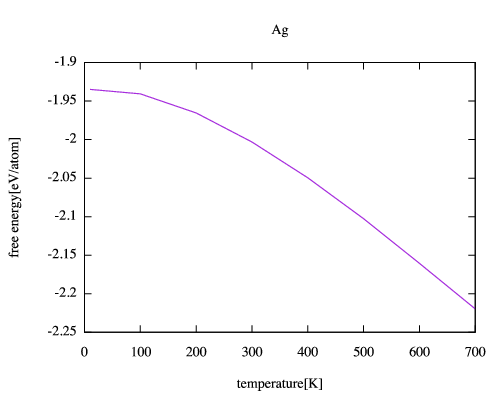
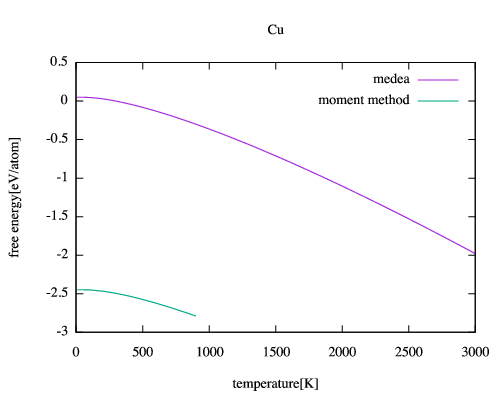
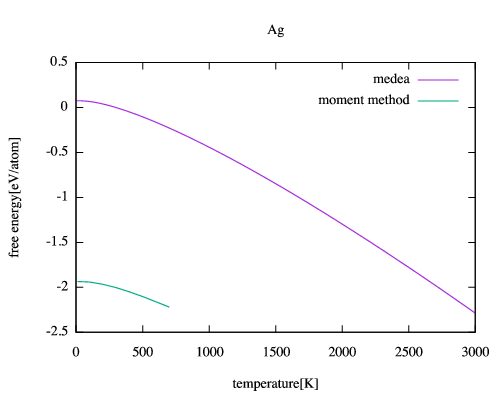

# Free energyの温度依存
Cuの場合
```sh
momentmethod sample_calc/jindo_Cu/ --plot energy
```




# Phonon-DOS法(Vasp)との比較
```sh
momentmethod sample_calc/jindo_Cu/ --plot medea
```





## 単位変換
kJ/mol = 6.242e21 / 6.022e23 eV = 1.0365e-2 eV
## 比熱
mapleでfittingを行い，温度の一次微分から比熱を計算する．
maplefileはmaple/specific_heat.mw

## 熱膨張
### medeaの計算結果をmaple用に変換
medea_result/CuAgAu_expansion/mkdate_expand.rb
```sh
ruby mkdata_expand.rb Ag Ag4maple
```
Ag/Ag_***/Job.outを読み込んで，Ag4maple内に出力．

### 途中経過メモ
1から1.04までだとfittingの点が足りないため1.08まで計算．
1.04までのグラフはtmpに保存しとく．．

### 熱膨張計算結果
